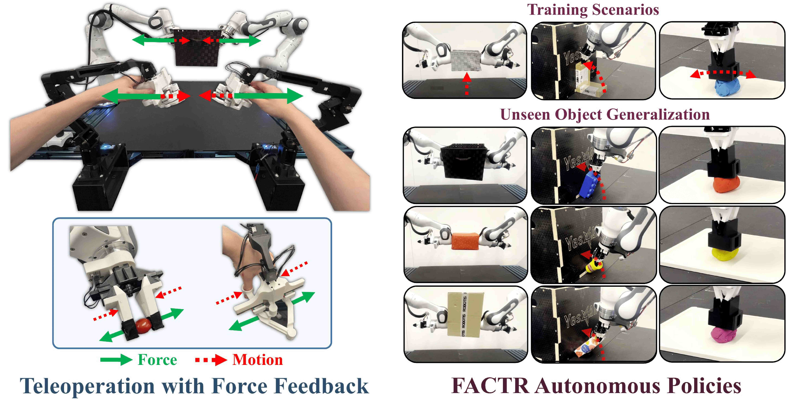

<h1> FACTR Teleop: Low-Cost Force-Feedback Teleoperation</h1>


#### [Jason Jingzhou Liu](https://jasonjzliu.com)<sup>\*</sup>, [Yulong Li](https://yulongli42.github.io)<sup>\*</sup>, [Kenneth Shaw](https://kennyshaw.net), [Tony Tao](https://tony-tao.com), [Ruslan Salakhutdinov](https://www.cs.cmu.edu/~rsalakhu/), [Deepak Pathak](https://www.cs.cmu.edu/~dpathak/)
_Carnegie Mellon University_

[Project Page](https://jasonjzliu.com/factr/) | [arXiV](https://arxiv.org/abs/2502.17432) | [FACTR](https://github.com/RaindragonD/factr/) | [FACTR Hardware](https://github.com/JasonJZLiu/FACTR_Hardware)

<h1> </h1>


<br>

## Catalog
- [Installation](#installation)
- [FACTR Teleop](#factr-teleop)
- [Data Collection](#data-collection)
- [Training and Deployment](#training-and-deployment)
- [License and Acknowledgements](#license-and-acknowledgements)
- [Citation](#citation)


## Installation

This repository requires **ROS 2**.
If you have not installed ROS 2 yet, follow the official [ROS 2 installation guide](https://docs.ros.org/en/humble/Tutorials/Beginner-Client-Libraries/Creating-A-Workspace/Creating-A-Workspace.html).

### Provided ROS 2 Packages

The following ROS 2 packages are included in this repository:

- `factr_teleop`
- `bc`
- `cameras`
- `python_utils`

These packages are located in:

```
<repo_root>/src
```

### ROS 2 Workspace Setup

These packages must reside within a **ROS 2 workspace**. If you do not already have one, create a workspace by following the [ROS 2 workspace tutorial](https://docs.ros.org/en/humble/Tutorials/Beginner-Client-Libraries/Creating-A-Workspace/Creating-A-Workspace.html).

Then:

1. Copy the four provided packages into your workspace's `src/` directory.
2. Ensure to source the ROS2 setup script in your terminal
   ```bash
   source /opt/ros/<ROS-Distribution>/setup.bash
   ```
   Note that this command should be run everytime you open a new terminal.
3. From the root of your workspace, build the workspace via:
   ```bash
   colcon build --symlink-install
   ```
   This should create the following folders in your workspace root
   ```bash
   build  install  log  src
   ```
4. From the root of your workspace, source the overlay via
   ```bash
   source install/local_setup.bash
   ```
   Note that this command should also be run everytime you open a new terminal.

> For more guidance, refer to the [ROS 2 Tutorial](https://docs.ros.org/en/humble/Tutorials/Beginner-Client-Libraries/Creating-A-Workspace/Creating-A-Workspace.html).

### Additional Python Dependencies

Install [ZMQ](https://zeromq.org/):

```bash
pip install zmq
```
Install [Pinocchio](https://stack-of-tasks.github.io/pinocchio/):
```bash
sudo apt install ros-<ROS-Distribution>-pinocchio
```
- For example,
   ```bash
   sudo apt install ros-humble-pinocchio
   ```
Alternatively, try the following via pip.
```bash
python -m pip install pin
```

Finally, navigate to the Dynamixel submodule and install it via:
```bash
cd <repo_root>/src/factr_teleop/factr_teleop/dynamixel
pip install -e python
```


## FACTR Teleop
Instructions for setting up FACTR leader arms and running the provided example demos can be found 
[here](src/factr_teleop/README.md).


## Data Collection
We provide instructions and sample data collection scripts in ROS2. You might need your custom nodes for robots and sensors to run the system. In our case, the collected data is saved in following format:
### Data Structure
Each trajectory is saved as a separate pickle file. Each pickle file contains a dictionary with the following structure:
```
trajectory.pkl
├── "data" : dict
│   ├── "topic_name_1" : list[data_points]
│   ├── "topic_name_2" : list[data_points]
│   └── ...
└── "timestamps" : dict
    ├── "topic_name_1" : list[timestamps]
    ├── "topic_name_2" : list[timestamps]
    └── ...
```
### Key Components:

- **data**: A dictionary where:
  - Keys are the data source names (ROS topic names in our implementation)
  - Values are lists containing the actual data points (low-dimensional states or images)

- **timestamps**: A dictionary where:
  - Keys are the same data source names as in the "data" dictionary
  - Values are lists containing the timestamps when each corresponding data point was recorded

*Note*: Different data sources may log at different frequencies, resulting in varying list lengths across data sources. The timestamps are crucial for properly aligning and post-processing the data.
While ROS provides synchronization APIs, we chose to record raw timestamps and perform post-processing to allow for greater flexibility in data analysis and alignment.
```python
# Example of a trajectory structure
{
    "data": {
        "/camera/rgb/image_raw": [image1, image2, ...],
        "/joint_states": [state1, state2, ...],
        "/robot/end_effector_pose": [pose1, pose2, ...]
    },
    "timestamps": {
        "/camera/rgb/image_raw": [1615420323.45, 1615420323.55, ...],
        "/joint_states": [1615420323.40, 1615420323.50, ...],
        "/robot/end_effector_pose": [1615420323.42, 1615420323.52, ...]
    }
}
```


## Training and Deployment

### Data Processing and Training
Please check for detailed instructions in our [factr](https://github.com/RaindragonD/factr) repo.

### Policy Rollout

We provide a sample rollout script in ROS2. In our case, the rollout launch file could be called as follows: 
```bash
ros2 launch factr_teleop/launch/rollout.py
```
Please checkout [rollout.py](launch/rollout.py) for details about configurations.


## License and Acknowledgements
This source code is licensed under the Apache 2.0 liscence found in the LICENSE file in the root directory of this repository.

This project builds on top of or utilizes the following third party dependencies.
- [GELLO](https://wuphilipp.github.io/gello_site/): Inpiration for this work.
- [ZMQ](https://zeromq.org/): Light-weight communication between python processes.
- [Pinocchio](https://stack-of-tasks.github.io/pinocchio/): Fast kinematics and dynamics computation for manipulation.


## Citation
If you find this codebase useful, feel free to cite our work!
<div style="display:flex;">
<div>

```bibtex
@article{factr,
  title={FACTR: Force-Attending Curriculum Training for Contact-Rich Policy Learning},
  author={Liu, Jason Jingzhou and Li, Yulong and Shaw, Kenneth and Tao, Tony and Salakhutdinov, Ruslan and Pathak, Deepak},
  journal={arXiv preprint arXiv:2502.17432},
  year={2025}
}
```
