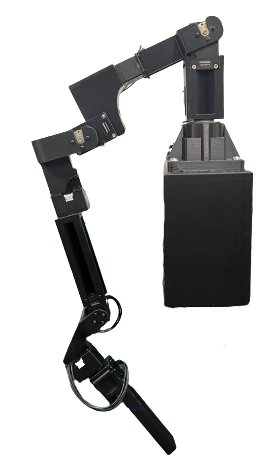

# Setting up Dynamixel Servos
Before launching the FACTR teleop leader arms, the leader arm's Dynamixel servos need to be properly
configured. Please install the [Dynamixel Wizard](https://emanual.robotis.com/docs/en/software/dynamixel/dynamixel_wizard2/)
software.

## Update Servo IDs
By default, all Dynamixel servos are set to ID 1. To control multiple servos with a single U2D2 controller, 
each servo must be assigned a unique ID. This assignment should be done one servo at a time, starting with 
the servo closest to the robot base and progressing up the kinematic chain. Assign IDs sequentially from 
1 up to 8, with the gripper trigger servo holding ID 8.

### Steps to Change a Servo's ID:
1. **Connect a single servo to the U2D2 controller.**
2. **Launch the Dynamixel Wizard software.**
3. **Configure the scanning settings:**
   - In the top menu bar, go to **Tools → Options**.
   - Under **"Select port to scan"**, ensure all ports are selected.
   - Under **"Select baudrate to scan"**, choose the correct baudrate. The default is **57600 bps**. If unsure, select all available options.
   - Under **"Set ID range to scan"**, you can speed up scanning by limiting the range to **0–15**, unless the servo might already have an ID outside this range.
4. **Click the Scan icon** (magnifying glass with a gear) in the top-left corner.
   - If the servo is found, it will appear in the left panel of the window.
5. **Select the detected servo** from the panel, then click **ID** found in the middle panel of the window.
   - Select the new ID on the right panel of the window and click **Save**.
6. **Repeat** the above steps for each servo.


## Increase Servo Control Frequency
There are additional Dynamixel servo settings that must be changed in order to run the control loop at
a frequency as fast as 500Hz. The steps for each servo are as follows:

### Steps to Increase Servo Control Frequency:
1. **Launch the Dynamixel Wizard software** and **scan for servos**.
2. **Select each detected servo** from the left-hand panel.
3. In the middle panel, click **"Baud Rate (Bus)"**:
   - On the right-hand panel, **set the value to 4 Mbps** and click **Save**.
4. In the middle panel, click **"Return Delay Time"**:
   - On the right-hand panel, **set the value to 0** and click **Save**.


In addition to the Dynamixel servo settings, it is crucial to minimize the latency of the USB port connected to the U2D2 controller
to achieve high-frequency control. The latency timer should be set to `1` for optimal performance.

### Steps to Check and Set USB Port Latency:

1. **List connected U2D2 devices**:
   ```bash
   ls /dev/serial/by-id/
   ```
   This will show device names for each connected U2D2 controller. For example:
   ```
   usb-FTDI_USB__-__Serial_Converter_FT7WBF8S-if00-port0
   usb-FTDI_USB__-__Serial_Converter_FT951EJA-if00-port0
   ```
   Identify the one corresponding to your **leader arm**. Replace `<device-name>` with the correct name in the next steps.

2. **Resolve the full path to the USB device**:
   ```bash
   readlink -f /dev/serial/by-id/<device-name>
   ```
   This will return something like:
   ```
   /dev/ttyUSB0
   ```

3. **Check the current latency timer value**:
   ```bash
   cat /sys/bus/usb-serial/devices/<ttyUSBx>/latency_timer
   ```
   Replace `<ttyUSBx>` with the ttyUSB device name from the previous step (e.g., `ttyUSB0`).

4. **If the value is not `1`, set it manually**:
   ```bash
   echo 1 | sudo tee /sys/bus/usb-serial/devices/<ttyUSBx>/latency_timer
   ```
   > **Note:** This command requires `sudo` permissions.

   > **Note:** Everytime the U2D2 controller USB is re-plugged into the computer, this command needs to be run again to ensure the
   latency timer is 1.


### Automated Latency Check

Note that the provided leader arm node **automatically checks** the latency timer when initializing the `FACTRTeleopFranka` class. 
It reads the `dynamixel_port` from the YAML config file and verifies that the latency timer is set to `1`.

If the latency is not correctly set, the script will:
- Raise an exception
- Output the exact `echo` command required to fix it

Since changing the latency timer requires `sudo` permissions, **you must run the command manually** when prompted.


# Preparing to Launch FACTR Teleop

## Implementing a Subclass of `FACTRTeleop`

Before running the FACTR teleoperation scripts, you must create a **subclass** of the `FACTRTeleop` base class, located at:

```
<repo_root>/src/factr_teleop/factr_teleop/factr_teleop.py
```

### What is `FACTRTeleop`?

`FACTRTeleop` is the core base class for implementing the FACTR low-cost, force-feedback teleoperation system for a **follower arm**. It includes the full control loop for the **leader arm**, and provides support for:

- Gravity compensation  
- Null-space regulation  
- Friction compensation  
- Force-feedback

### Why Subclass It?

Force-feedback teleoperation requires **bi-directional communication** between the leader and follower arms. Since communication mechanisms vary across systems, **users are responsible for implementing this communication layer** by subclassing `FACTRTeleopFranka`.

Your subclass must implement abstract methods that achieve functions such as:

- Receiving **joint torque data** from the follower (for force-feedback)
- Publishing **joint position targets** to the follower
- Sending and receiving force-feedback signals for the **gripper** (gripper-specific implementation is left to the user)
- ...

This design allows easy integration with your existing communication pipeline or custom framework.

### Provided Example: ZMQ Implementation

We provide an example subclass:  
```
<repo_root>/src/factr_teleop/factr_teleop/factr_teleop_franka_zmq.py
```

This implementation, `FACTRTeleopFrankaZMQ`, demonstrates:

- How to use **ZMQ** for communication between leader and follower arms  
- An example of **gripper force-feedback** using a Dynamixel servo-based gripper

Use this as a reference or starting point when creating your own subclass tailored to your setup.


**Note:** If you create a custom subclass, make sure to add it under the `entry_points` section in this package's `setup.py`.
Here's the provided example in `setup.py`:
```python
entry_points={
    'console_scripts': [
        'factr_teleop_franka = factr_teleop.factr_teleop_franka_zmq:main',
        'factr_teleop_grav_comp_demo = factr_teleop.factr_teleop_grav_comp_demo:main',
    ],
},
```


## Creating a FACTR Teleop Configuration YAML File

Each leader arm requires its own YAML configuration file used by `FACTRTeleopFranka`, located in:

```
<repo_root>/src/factr_teleop/factr_teleop/configs
```

We provide an example configuration file here:

```
<repo_root>/src/factr_teleop/factr_teleop/configs/franka_example.yaml
```

This file contains all necessary parameters for initializing and running the FACTR teleop system. Below is a breakdown of key fields and how to configure them.

---

### `dynamixel` Settings

- **`dynamixel_port`**:  
  Specify the correct USB port for the U2D2 controller connected to the leader arm. You can find it by running:
  ```bash
  ls /dev/serial/by-id/
  ```
  Select the device name corresponding to your leader arm.

- **`joint_signs`**:  
  After starting teleoperation, some follower arm joints may move in the opposite direction of the leader arm.
  This can be corrected by changing the sign (`1` or `-1`) for each joint.

  If the leader arm is assembled exactly according to the build instructions (especially servo orientation), these signs do **not** need to be changed.

---

### `initialization` Settings

- **`calibration_joint_pos`**:  
  This is the joint configuration of the leader arm at startup, used for calibration with the follower arm.  
  When the teleop node is launched, the script calibrates the Dynamixel servos with respect to the Franka arm to ensure the joint
  position readings of the leader arm correspond to those of the follower arm.

  > **Important**: Before launching the program, physically place the leader arm into a configuration specified by `calibration_joint_pos`.

  In the provided `franka_example.yaml`, this configuration corresponds to the image below:

  

  **Figure 1**: `calibration_joint_pos` in `franka_example.yaml`.

  It is recommended to set calibration_joint_pos to a stable, resting configuration that does not require someone to hold up the leader arm (as shown in Figure 2). This makes it more convenient to launch the program.

  

  **Figure 2**: Resting configuration.

- **`initial_match_joint_pos`**:  
  This is the joint configuration the leader arm must be manually moved to **before** the follower arm begins mirroring it.  
  It should match the initial/current joint position of the Franka follower arm. In the provided example, this also corresponds 
  to the configuration shown in Figure 1.


# FACTR Teleop Start-Up Procedure

Once the subclass and YAML configuration file have been prepared, you are ready to launch the FACTR force-feedback teleoperation system. The following steps outline the startup procedure and what to expect following launching:

1. **Manually move the leader arm** to the joint configuration specified by the `calibration_joint_pos` parameter in the YAML file.
   - This ensures proper calibration with the follower arm.
   - **Important**: Also position the **leader gripper trigger** to correspond to the **closed state** of the follower gripper.

2. **Launch the teleop node** using your custom launch file. For example, from the `<repo_root>` directory:
   ```bash
   ros2 launch launch/factr_teleop.py
   ```

3. **Check USB latency timer** (automated):
   - If the USB latency timer is **not set to 1**, the script will exit with an error and print the command needed to fix it:
     ```bash
     echo 1 | sudo tee /sys/bus/usb-serial/devices/<ttyUSBx>/latency_timer
     ```
   - This process is explained in more detail in the [USB Latency section](#steps-to-check-and-set-usb-port-latency).
   - After setting the correct latency, **re-run the launch command**.

4. **Match the leader arm to `initial_match_joint_pos`**:
   - Once the script runs without errors, follow the terminal prompt to move the leader arm to the joint configuration specified by `initial_match_joint_pos`.
   - When the position is matched, teleoperation will automatically begin — enabling gravity compensation, null-space control, and force-feedback.

**Note:** After terminating the program, the leader arm is intended to apply zero torque and power off automatically. However, this may not always occur as expected.  If the arm remains powered, simply unplug and re-plug the leader arm's power cord to fully power it off.


## Gravity Compensation Demo
We provide an additional example that does **not** communicate with or send commands to a follower Franka arm, and can therefore be launched readily
without additional user implementations — as long as the **`dynamixel_port`** parameter is correctly configured in the YAML file.

This demo showcases the **gravity compensation** and **null-space regulation** functionalities of the leader arm.

- The subclass used for this example is `FACTRTeleopFrankaGravComp`, located at:
  ```
  <repo_root>/src/factr_teleop/factr_teleop/factr_teleop_grav_comp_demo.py
  ```

- The corresponding YAML configuration file is:
  ```
  <repo_root>/src/factr_teleop/factr_teleop/configs/grav_comp_demo.yaml
  ```

To launch the demo, ensure the leader arm is moved to the configuration shown in Figure 1 and run:

```bash
ros2 launch launch/factr_teleop_grav_comp_demo.py
```

**Note:** You can fine-tune gravity compensation by adjusting the **`gain`** parameter under **`gravity_comp`** in the YAML file. Increasing the gain applies stronger gravity compensation; decreasing it reduces the effect.


